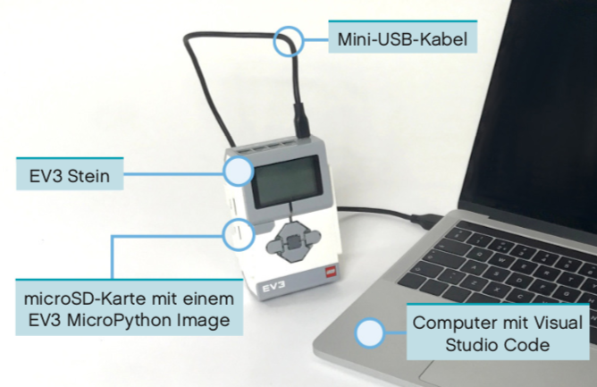
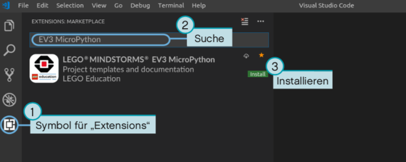
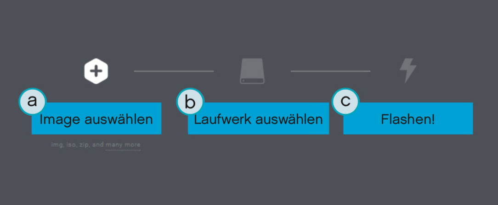
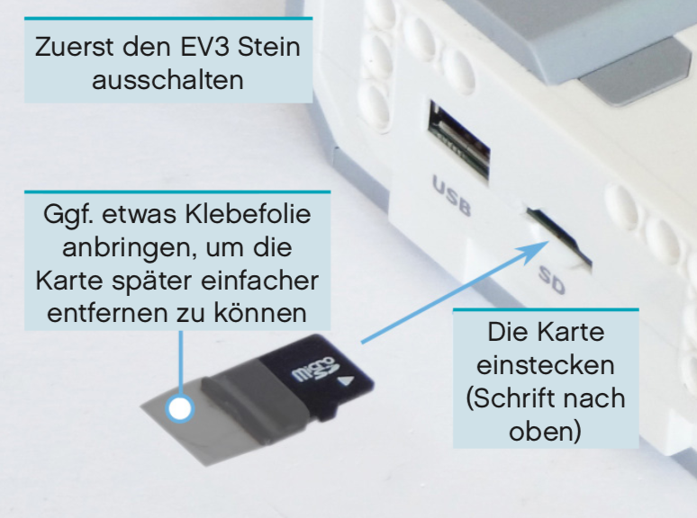
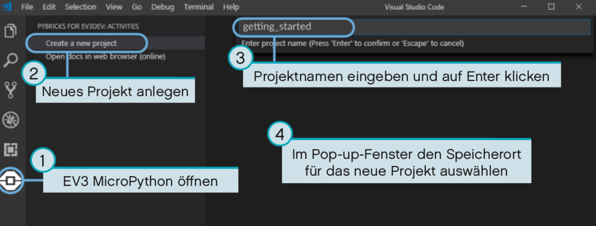
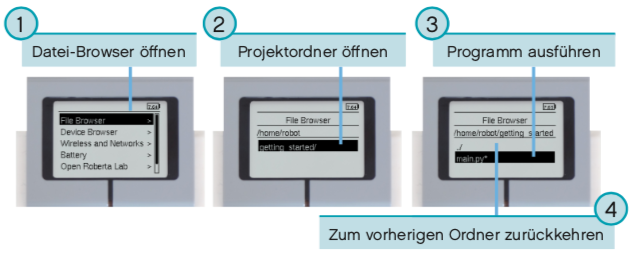

# Lego Education
## Erste Schritte mit LEGO MINDSTORMS Education EV3 - MicroPython
Bei unklarheiten wird auf die [Lego Education Webseite](https://education.lego.com/de-de/support/mindstorms-ev3/python-for-ev3) verwiesen. Die folgenden Bilder stammen ebenso von der Lego Education Webseite. Werden jedoch im laufenden mit eigenen Bildern ersetzt.
### Benötigte Bausteine
* Einen Windows oder Apple Computer
* Eine Internetverbindung sowie Administratorrechte um benötigte Programme herunterladen zu können.
* Eine microSD Karte die mindestens 4 GB und maximal 32 GB Speicherkapazität aufweißt.
* Ein vollständiges EV3 Set, d. h. EV3 Stein mit einem Mini USB Verbindungskabel.



### Vorbereitung
Um mit MicroPython Programmen arbeiten zu können wird eine spezielle Entwicklungsumgebung benötigt. Hierbei bedient man sich _Visual Studio Code_ gekoppelt mit der _EV3 MicroPython_ Extension.
* [Visual Studio Code](https://code.visualstudio.com/download) herunterladen, installieren und starten.
* Extension [EV3 MicroPython](https://marketplace.visualstudio.com/itemdetails?itemName=lego-education.ev3-micropython) in dem Visual Studio Code Marketplace installieren.



### Preparation der microSD Karte
Damit das MicroPython Programm erfolgreich gestartet werden kann, muss die microSD Karte vorbereitet werden. Dafür müssen alle Dateien auf die microSD Karte gespeichert werden. Vorsicht, denn damit wird alles auf dem EV3 Stein gelöscht.
* Herunterladen des [EV3 MicroPython Image](https://le-www-live-s.legocdn.com/sc/media/files/ev3-micropython/ev3micropythonv100sdcardimage-4b8c8333736fafa1977ee7accbd3338f.zip) herunter. Es werden keine weiteren Präparation mit dem Ordner benötigt.
* Herunterladen und Installieren des [Etcher Flashing Tool](https://www.balena.io/etcher/). Mit dem FLashing Tool wird die microSD Karte vorbereitet.
* microSD Karte einstecken und das Flashing Tool starten. Es sollte den Anweisungen auf dem Bildschirm folge geleistet werden:
    * microSD Karte (mit dem EV3 MicroPython Image) auswählen.
    * Flashing Prozess starten. Dies kann einige Minuten dauern, bitte die Karte nicht entfernen.

### Aktualisierung der microSD Karte
Um die microSD Karte zu aktualisieren, muss erneut ein [EV3 MicroPython Image](https://le-www-live-s.legocdn.com/sc/media/files/ev3-micropython/ev3micropythonv100sdcardimage-4b8c8333736fafa1977ee7accbd3338f.zip) ausgewählt werden. Der Flashing Prozess muss erneut ausgeführt werden, dabei sollte beachtet werden das alle Dateien auf der Karte dabei gelöscht werden.



### EV3 Stein verwenden
Um mit dem EV3 Stein zu arbeiten, muss die microSD Karte wie folgt eingesetzt werden.
* Der EV3 Stein sollte ausgeschlatet sein, falls er dies nicht bereits ist.
* Die microSD KArte muss an den vorgesehenen Platz ein.
    * Falls notwendig versehen muss die Karte mit einer Klebefolie, damit diese leichter entnommen werden kann.
* Der EV3 Stein kann wieder eingeschaltet werden.



### EV3 Stein Ein- und Ausschalten
Um den EV3 Stein _einzuschalten_ muss die dunkelgraue Taste in der mitte betätigt werden. Währrend dem Hochfahren blinkt die Statusleuchte Orange auf und Text erscheint auf dem Display. Erst wenn die Statusleuchte Grün aufleuchtet ist der EV3 Stein einsatzbereit.

Um den EV3 Stein _auszuschalten_ muss die Zurücktaste betätigt werden, währrend man sich im Hauptmenü befindet. Nun wird _Power Off_ ausgewählt und der EV3 Stein schaltet sich aus.

### Motor- und Sensorwerte
Es sollte der _Device Browser_ ausgewählt werden. Nun muss der gewünschte Typ ausgewählt werden, z. B. _Motors_ für die Motorwerte. Anschließend kann _Watch Values_ bestätigt werden.

## Erstellen und Ausführen von MicroPython Programmen
### Anlegen von Projekts
Damit ein neues Projekt angelegt werden kann, muss in Visual Studio Code das EV3 MicroPython Symbol ausgewählt werden. In dem nun geöffneten Textfeld kann der Projektnamen eingegeben werden. Anschließend wird der Speicherort des Programmes ausgewählt und mit _chooos folder_ bestätigt.



Nun hat sich in dem Explorer eine Python Datei namens main&#46;py erstellt. Diese wird geöffnet und mit deinem Programm beschrieben. Von dieser Datei aus startet der EV3 Stein das Programm. Falls noch keine Erfahrung in der Programmierung mit Python besteht, wird empfohlen den bereits vorhandenen Code lediglich zu erweiteren.

### Öffnen von Projekten
Falls nun bereits ein MicroPython Projekt in Visual Studio Code erstellt worden ist, kann es wie folgt geöffnet werden:
* Wählen Sie _File_ in der oberen Menüleiste aus.
* Wählen Sie _Open Folder_ um das bereits angelegt Projekt zu öffnen.

### EV3 Stein mit Visual Studio Code verbinden
Um das Programm nun auf den EV3 Stein zu übertragen muss dieser eingeschaltet über das Mini USB Kabel mit deinem Computer verbunden sein.
* Datei Symbol auswählen
* Geräte Browser öffnen
* Nach dem EV3 Stein suchen und auswählen

### Programm Herunterladen und Ausführen
Um ein MicroPython Programm _ausführen_ zu können, kann entweder mittels der _F5 Taste_ oder in dem Debug Fenster mittels dem grünen _Play Pfeil_ gestartet werden. Ausgabe Befehle wie _print_ wird in dem Ausgabefenster angezeigt.

Um ein MicroPython _stoppen_ zu können, wird das kleine _Rote Quadrat_ neben dem _Play Pfeil_ betätigt.


### Beispielprogramm ergänzen
Nun ist Visual Studio Code eingerichtet und der Beispielcode ist ausführbar. Nun kann darauf aufgebaut werden.

Doch zunächst muss einer der großen Motoren an den EV3 Stein, über den Port B, angeschlossen werden.


Das Beispielprogramm wird wie folgt erweitert. Damit kann dein Programm ein Piepton von sich geben. Der Motor dreht sich einmal und der Piepton kommt erneut in einer höheren Tonlage.
```python
 #!/usr/bin/env pybricks-micropython
from pybricks import ev3brick as brick
from pybricks.ev3devices import Motor
from pybricks.parameters import Port

# Gebe ein Piepton ab
brick.sound.beep()

# Initialisiere den Motor an Port B
test_motor = Motor(Port.B)

# Lassen Sie den Motor mit bis zu 500 Grad pro Sekunde laufen. Auf einen Zielwinkel von 90 Grad.
test_motor.run_target(500, 90)

# Gebe erneut ein Piepton von dir ab.
# Diesmal mit höherer Tonhöhe (1000 Hz) und längerer Dauer (500 ms).
brick.sound.beep(1000, 500)
```

### Verwalten von Dateien auf dem EV3 Stein
Nun ist ein Projekt erfolgreich auf dem EV3 Stein geladen und gespeichert. In Visual Studio Code kannst du nun an den Dateien, die auf deinem Computer sind,  arbeiten oder an den Dateien, die auf deinem EV3 Stein geladen sind, arbeiten. Mit einem Rechtsklick öffnet sich ein Kontextmenü in dem du die Datei ausführen, von dem EV3 Stein löschen, auf den Computer hochladen oder mehr Informationen anzeigen.


### MicroPython Programm auf dem EV3 Stein ausführen
Um ein MicroPython Programm auf dem EV3 Stein (auf dem Robotor) ausführen zu können, muss der EV3 Stein wie bereits beschrieben eingeschaltet werden. Der Projektordner muss ausgewählt und die main&#46;py Datei bestätigt. Damit startet das Programm und somit der Robotor idealerweiße.



## Programmierung des EV3 Stein
### Tasten
`buttons()`
Überprüft, welche Taste gerade gedrückt ist.
> **Return** Liste der gedrückten Tasten \
> **Return Typ** Liste

```python
# Gebe 'Der Linke Button ist gedrückt.' auf der Kommandozeile aus wenn der Linke Button gedrückt worden ist.
if button.LEFT in brick.buttons():
    print("Der Linke Button ist gedrückt.")

# Warte so lange bis ein Knopf gedrückt worden ist.
while not any(brick.buttons()):
    wait(10)
```
___
### Leuchte
`light(color)` 
Die Farbe der EV3 Stein Leuchte wird eingestellt.
> **Parameter `color(Color)`** Farbe des Lichts, `None` für keins und z. B. `Color.BLACK` für deine Schwarze Leuchte.
```python
# Gebe ein Rotes Licht von dir
brick.light(Color.RED)

# Mache das Licht aus
brick.light(None)
```
___
### Sound
`sound.beep(frequency, duration, volume)`
Die Frequenz, Dauer und Lautstärke von einem Piepton des EV3 Stein kann eingestellt und abgespielt werden.
> **Parameter `frequency: int`** Frequenz des Pieptons in Hz, Standard: 500 \
> **Parameter `duration: int`** Dauer des Pieptons in ms, Standard: 100 \
> **Parameter `volume: int`** Lautstärke des Pieptons in Prozent, Standard: 300
```python
# Normaler Piep Ton
brick.sound.beep()

# Eingestellter Piep Ton
brick.sound.beep(750, 2000, 80)
```

`sound.beeps(number)`
Anzahl an abzuspielender Töne, mit einer kleiner Pause dazwischen.
> **Parameter `number: int`** Anzahl der Töne
```python
# Mache 10 Töne
brick.sound.beeps(10)
```

`sound.file(file_name, volume)`
Spielt ein Datei mit angegebener Lautstärke ab.
> **Parameter `file_name: str`** Abzuspielende Datei
> **Parameter `volume: int`** Lautstärke
```python
# Spiele ein installiertes File ab
brick.sound.file(SoundFile.HELLO)

# Spiele in eigenes File ab
brick.sound.file('hello.wav')
```
___
### Bildschirm
`display.clear()`
Setzt das Display auf den EV3 Stein zurück.
```python
# Setzte das Display zurück
brick.display.clear()
```

`display.text(text, coordinate=None)`
Gibt den Text bei den Koordinaten auf dem Display aus.
```python
# Lösche das Display
brick.display.clear()

# Gebe 'Lego!' mittig aus
brick.display.text('Lego', (60, 50))

# Gebe 'Mindstorm' direkt darunter aus
brick.display.text('Mindstorm')
```

`display.image(file_name, alignment=Align.CENTER, coordinate=None, clear=True)`
Gebe eine Bilddatei auf dem Display aus. Entweder durch das Alignment oder durch die Coordinaten. Nicht durch beides.
> **Parameter `file_name: str`** Dateipfad zur Datei, relativ oder absolut \
> **Parameter `alignment: Align`** Platzierung der Datei auf dem Bildschirm. Standard ist Center \
> **Parameter `(x,y): Tupel`** Koordinaten - Tupel \
> **Parameter `clear:  bool`** Anzeige kann vor dem Anzeigen des Bildschirms zurückgesetzt werden.
```python
# Zeige zwei nach oben schauende Augen
brick.display.image(ImageFile.UP)

# Zeige ein eigenes Bild
brick.display.image('hochschauendeAugen.png')

# Zeige ein eigendes Bild: oben-links - Anzeige wird gelöscht
brick.display.image('hochschauendeAugen.png', Align.TOP_LEFT, clear=True)
```
___
### Akku
`battery.voltage()`
Akkuspannung wird abgefragt.
> **Return** Akkuspannung \
> **Return Typ** voltage: mV
```python
# Gebe einen Warntöne bei weniger wie 7V ab
if brick.battery.voltage() < 7000:
    brick.sound.beeps(100)
```
___
### Motoren
`port(Port)`
Legt den Anschluss fest, an dem der Motor an den EV3 Stein angeschlossen ist.
> **Paramter `port: Port`** Port des Motors

`direction(Direction)`
Legt die Drehrichtung des Motors fest. Standard ist Clockwise, d. h. Positive Drehrichtung
> **Paramter `direction: Direction`** Drehrichtung

`gears(list)`
Legt die Liste der Zahnräder fest, die am Motor verbunden sind.
> **Paramter `list: List`** Liste der Zahnräder

___
### Motoren ohne Drehsensor
`dc(duty)`
Arbeitszyklus für Motoren die keinen Drehsensor haben, wird festgelegt.
> **Parameter `duty: %`** Arbeitszyklus von -100% bis 100%
___
### Motoren mit Drehsensor
`angle()`
Drehwinkel des Motors wird zurückgegeben.
> **Return** Drehwinkel \
> **Return Typ** angle: deg

`reset_angle(angle)`
Setzt den Drehwinkel des Motors zurückgesetzt
> **Parameter `angle: deq`** Drehwinkel auf den zurückgesetzt werden soll.

`speed()`
Geschwindigkeit des Motors wird zurückgegeben
> **Return** Motorgeschwindigkeit \
> **Return Typ** rotational speed: deg/s

`run(speed)`
Motor startet und läuft mit einer konstanten Geschwindigkeit.
> **Parameter `speed: deg/s`** Geschwindigkeit des Motors

`stop(stop_type)`
Motor wird angehaltenn
> **Parameter `stop_type: Stop`** Bestimmt ob der Motor auslaufen oder abbremsen soll. Standard: Stop.COAST

`run_time(speed, time, stop_type, wait)`
Motor läuft eine bestimmte Zeit lang konstant.
> **Parameter `speed: deg/s`** Geschwindigkeit des Motors \
> **Parameter `stop_type: Stop`** Bestimmt ob der Motor auslaufen oder abbremsen soll. Standard: Stop.COAST \
> **Parameter `time: ms`** Dauer der Fahrt \
> **Parameter `wait: bool`** Bestimmt ob die Fahrt zuerst beendet sein muss, bevor das restliche Programm zu ende ausführt. Dabei wartet das Programm, die zeitdauert `time`.

`run_angle(speed, rotation_angle, stop_type, wait)`
Motor läuft bis zu einem bestimmten Winkel kostant.
> **Parameter `speed: deg/s`** Geschwindigkeit des Motors \
> **Parameter `stop_type: Stop`** Bestimmt ob der Motor auslaufen oder abbremsen soll. Standard: Stop.COAST \
> **Parameter `rotation_angle: deq`** Drehwinkel auf den zurückgesetzt werden soll \
> **Parameter `wait: bool`** Bestimmt ob die Fahrt zuerst beendet sein muss, bevor das restliche Programm zu ende ausführt. Dabei wartet das Programm, die zeitdauert `time`.

`run_target(speed, rotation_angle, stop_type, wait)`
Motor läuft bis zu einem bestimmten Zielwinkel kostant.
> **Parameter `speed: deg/s`** Geschwindigkeit des Motors \
> **Parameter `stop_type: Stop`** Bestimmt ob der Motor auslaufen oder abbremsen soll. Standard: Stop.COAST \
> **Parameter `rotation_angle: deq`** Drehwinkel auf den zurückgesetzt werden soll \
> **Parameter `wait: bool`** Bestimmt ob die Fahrt zuerst beendet sein muss, bevor das restliche Programm zu ende ausführt. Dabei wartet das Programm, die zeitdauert `time`.

`track_target(target_angle)`
Zielwinkel wird anvisiert und im laufe der Zeit angepasst.
> **Parameter `target_angle: deg`** Zielwinkel an den sich der Motor anpassen soll

`stalled()`
Gibt zurück ob der Motor blockiert, d.  h. wenn sich der Motor bei Maximalem Drehmoment nicht mehr bewegen kann.
> **Return** `True`: Motor blockiert, `False`: Motor blockiert nicht \
> **Return Typ** bool

`run_until_stalled(speed, rotation_angle, duty_limit)`
Motor läuft bis er blockiert hat.
> **Parameter `speed: deg/s`** Geschwindigkeit des Motors \
> **Parameter `rotation_angle: deq`** Drehwinkel auf den zurückgesetzt werden soll \
> **Parameter `duty: % `** Drehmoment des Motors, verhindert das Getriebemechanismen mit vollem Motordrehmoment angetrieben werden.

`set_dc_settings(duty_limit,  duty_offset)`
Einstellungen für den `dc(duty)` - Befehl werden vorgenommen.
> **Parameter `duty_limit: %`** Begrenzung des Drehmoments während den folgenden Motorbefehlen. \
> **Parameter `duty_offset: %`** Mindest Arbeitszyklus um den `dc(duty)` Befehl auszuführen.

`set_run_settings(max_speed, acceleration)`
Maximale Geschwindigkeit und Beschleunigung bzw. Abbremsungdes motors wird festgelegt.
> **Parameter `max_speed: deg/s`** Maximale Geschwindigkeit die der Motor aufbauen kann. \
> **Parameter `acceleration: deq/s/s`** Beschleunigung auf die Zielgeschwindigkeit bzw. Abbremsung bis zum Stillstand.

`set_pid_settings(kp, ki, kd, tight_loop_limit, angle_tolerance, speed_tolerance, stall_speed, stall_time)`
Einstellung für die Positionsregler und Geschwindigkeitsregler.
> **Parameter `kp: int`** Konstante für die proportionale Position. \
> **Parameter `ki: int`** Konstante für die integrale Position. \
> **Parameter `kd: int`** Konstante für die abgeleitete Position. \
> **Parameter `tight_loop_limit: ms`** Wenn ein Run Befehl in diesem Ziet Intervall ausgeführt wird, nimmt der PID Regler an, dass die Geschwindigkeit direkt gesteuert werden soll. Er ignoriert die vorgebene Geschwindigkeit und nutzt die aus dem `run()`-Befehl. Gut geeinget für Schnelle Kurven etc. \
> **Parameter `angle_tolerance: deq`** Abweichung von dem Zielwinkel, bevor es als abgeschlossen gilt. \
> **Parameter `speed_tolerance: deg/s`** Abweichung von der Zielgeschwindigkeit, bevor es als abgeschlossel gilt. \
> **Parameter `stall_speed: deg/s`** Motor blockiert aber hat sein Maximum noch nicht erreicht (actuall_speed < stall_speed). \
> **Parameter `stall_time: deg/s`** Anfälligkeit des Motors zum blockieren kann hiermit gesteuert werden.
___
### Sensoren
### Berühungssensor
`class TouchSensor(port)` wird unterstütz von den Teilen 31313, 45544 und 45507.
> **Parameter `port: Port`** Anschluss, an dem der Sensor angeschlossen ist.

`pressed()` Überprüft ob den Sensor gedrückt wird.
> **Return** `True`: Sensor wird gedrückt, `False`: Sensor wird nicht gedrückt \
> **Return Typ** bool
___
### Farbsensor
`class ColorSensor(port)` wird unterstütz von den Teilen 31313, 45544 und 45507.
> **Parameter `port: Port`** Anschluss, an dem der Sensor angeschlossen ist.

`color()` Gibt die Farbe einer Oberfläche zurück.
> **Return** `Color.<Farbe>`: Farbe kanns ein: BLACK, BLUE, GREEN, YELLOW, RED, WHITE, BROWN, NONE \
> **Return Typ** Color oder None

`ambient()` Misst die Stärke des Umgebungslicht.
> **Return** Stärke des Umgebungslichts.
> **Return Typ** percentage: %

`reflection()` Gibt die Reflektion eines roten Lichts auf einer Oberfläche zurück.
> **Return**: Reflexion von 0 bis 100 (schwach / kaum bis stark) \
> **Return Typ** percentage: %

`rgb()` Misst die Reflektion des roten dann grünen, dann blauen Lichts auf einer Oberfläche.
> **Return** Reflexion von 0 bis 100 (schwach / kaum bis stark) von rot, grün, blau. \
> **Return Typ** Tupel mit drei percentages: %
___
### Infrarotsensor und -sender
`class InfraredSensor(port)` wird unterstütz von den Teilen 31313 und 45509.
> **Parameter `port: Port`** Anschluss, andem der Sensor angeschlossen ist.

`distance()` Gibt den relativen Abstand zwischen Sensor und Objekt zurück.
> **Return** relativer Abstand zwischen 0 und 100 (nah und weit). \
> **Return Typ** relativ distance: %

`beacon(channel)` Gibt den relativen Abstand und den Winkel zwischen Sensor und Objekt zurück.
> **Parameter `channel: int`** Kanalnummer der Fernsteuerung. \
> **Return** relativer Abstand zwischen 0 und 100 (nah und weit) und den Winkel (-75 bis 75 Grad) zwischen den Fernbedinung und dem Sensor. \
> **Return Typ** Tupel mit relativ distance: % und angle: deg oder (None, None) wenn nichts erkannt wird.

`buttons(channel)` Überprüft welche Tasten auf der Fernbedinung gedrückt sind.
> **Parameter `channel: int`** Kanalnummer der Fernsteuerung. \
> **Return** Liste der gedrückten Tasten für den Kanal. \
> **Return Typ** Liste von Buttons
___
### Ultraschallsensor
`class UltrasonicSensor(port)` wird unterstütz von den Teilen 45544 und 45504.
> **Parameter `port: Port`** Anschluss, andem der Sensor angeschlossen ist.

`distance(silent)` Ultraschallwellen messen den Abstand zwischen Sensor und Objekt.
> **Parameter `silent: bool`** `True` um den Sensor nach dem Messen abzuschalten. Standard ist `False` \
> **Return** Abstand in Millimeter \
> **Return Typ** distance: mm

`presence()` Es wird nach Ultraschallwellen gesucht um zu überprüfen, ob sich andere Ultraschallsensoren in der Nähe befinden.
> **Return** `True` wenn etwas erfasst wurde, `False` wenn nicht. \
> **Return Typ** bool.
___
### Gyrosensor
`class GyroSensor(port)` wird unterstütz von den Teilen 45544 und 45505.
> **Parameter `port: Port`** Anschluss, andem der Sensor angeschlossen ist.

`speed()` (Winkel-) Geschwindigkeit des Sensor wird abgerufen.
> **Return** Winkelgeschwindigkeit des Sensors \
> **Return Typ** rotational speed: deq/s.

`angle()` Der Kumulierte Winkel des Sensor wird abgerufen.
> **Return** Umdrehungswinkel des Sensors \
> **Return Typ** angle: deg.

`reset_angle(angle)` Drehwinkel des Sensors wird auf einen Standardwert eingestellt.
> **Parameter `angle: deg`** Wert der eingestellt werden soll.

## Parameter und Konstanten des EV3 Stein
### Port
Motoranschlüsse: `A`, `B`, `C`, `D` \
Sensoranschlüsse: `S1`, `S2`, `S3`, `S4`
___
### Direction
`CLOCKWISE` ist die Geschwindigkeit positiv dreht sich der Motor im Uhrzeigersinn. \
`COUNTERCLOCKWISE` ist die Geschwindigkeit negativ dreht sich der Motor gegen den Uhrzeigersinn.
___
### Stop
`COAST` Motor kann sich frei bewegen. \
`BRAKE` Motor hält kleinen Kräften von äußen relativ gut stand. \
`HOLD` Motor wird gesteuert um den Winkel zu halten. (Nur bei Motoren mit Drehsensoren).
___
### Color
`BLACK`, `BLUE`, `GREEN`, `YELLOW`, `RED`, `WHITE`, `BROWN`, `ORANGE`, `PURPLE`
___
### Button
Für den EV3 Stein oder die Fernsteuerung \
`LEFT_DOWN`, `DOWN`, `RIGHT_DOWN`, `LEFT`, `CENTER`, `RIGHT`, `LEFT_UP`, `UP`, `BEACON`, `RIGHT_UP`
___
### Align
`BOTTOM_LEFT`, `BOTTOM`, `BOTTOM_RIGHT`, `LEFT`, `CENTER`, `RIGHT`, `TOP_LEFT`, `TOP`, `TOP_RIGHT`
___
### ImageFile
Information \
`RIGHT`, `FORMARD`, `ACCEPT`, `QUESTION_MARK`, `STOP_1`, `LEFT`, `DECLINE`, `THUMBS_DOWN`, `BACKWARD`, `NO_GO`, `WARNING`, `STOP_2`, `THUMBS_UP`

Lego \
`EV3`, `EV3 ICON`

Objekte \
`TARGET`

Augen \
`BOTTOM_RIGHT`, `BOTTOM_LEFT`, `EVIL`, `CRAZY_2`, `KNOCKED_OUT`, `PINCHED_RIGHT`, `WINKING`, `DIZZY`, `DOWN`, `TIRED_MIDDLE`, `MIDDLE_RIGHT`, `SLEEPING`, `MIDDLE_LEFT`, `TIRED_RIGHT`, `PINCHED_LEFT`, `PINCHED_MIDDLE`, `CRAZY_1`, `NEUTRAL`, `AWAKE`, `UP`, `TIRED_LEFT`, `ANGRY`
___
### SoundFile
Ausdrücke \
`SHOUTING`, `CHEERING`, `CRYING`, `OUCH`, `LAUGHING_2`, `SNEEZING`, `SMACK`, `BOING`, `UH_OH`, `SMORING`, `KUNG_FU`, `FANFARE`, `CRUNCHING`, `MAGIC_WAND`, `LAUGHING_1`

Information \
`LEFT`, `BACKWARDS`, `RIGHT`, `OBJECT`, `COLOR`, `FLASHING`, `ERROR`, `ERROR_ALARM`, `DOWN`, `FORWARD`, `ACTIVATE`, `SEARCHING`, `TOUCH`, `UP`, `ANALYZE`, `STOP`,`DETECTED`, `TURN`, `START`

Kommunikation \
`MORNING`, `EV3`, `GO`, `GOOD_JOB`, `OKEY_DOKEY`, `GOOD`, `NO`, `THANK_YOU`, `YES`, `GAME_OVER`, `OKAY`, `SORRY`, `BRAVO`, `GOODBYE`, `HI`, `HELLO`, `MINDSTORMS`, `LEGO`, `FANTASTIC`

Bewegung \
`SPEED_IDLE`, `SPEED_DOWN`, `SPEED_UP`

Farbe \
`BROWN`, `GREEN`, `BLACK`, `WHITE`, `RED`, `BLUE`, `YELLOW`

Mechanisch \
`TICK_TACK`, `HORN_1`, `BACKING_ALERT`, `MOTOR_IDLE`, `AIR_RELASE`, `AIRBRAKE`, `RETCHET`, `MOTOR_STOP`, `HORN_2`, `LASER`, `SONAR`, `MOTOR_START`

Tiere \
`INSECT_BUZZ_2`, `ELEPHANT_CALL_2`, `SNAKE_HISS`, `DOG_BARK_2`, `DOG_WHINE`, `INSECT_BUZZ_1`, `DOG_SNIFF`, `T_REX_ROAR`, `INSECT-CHIRP`, `DOG_GROWL`, `SNAKE_RATTLE`, `DOG_BARK_1`, `CAT_PURR`

Zahlen \
`ZERO`, `ONE`, `TWO`, `THREE`, `FOUR`,
`FIVE`, `SIX`, `SEVEN`, `EIGHT`, `NINE`, `TEN`

System \
`READY`, `CONFIRM`, `GENERAL_ALERT`, `CLICK`, `OVERPOWER`

## Zeiterfassung
`wait(time)` Programm pausiert eine vorgegebene Zeit.
> **Parameter `time: ms`** Wartezeit.

`class StopWatch` Eine Stoppuhr die zum Messen von Zeitintervallen dient.

`time()` Aktuelle Zeit auf der Stopuhr wird abgerufen.
> **Return** verstrichene Zeit \
> **Return Typ** time:ms

`pause()` Die Stoppuhr wird angehalten

`resume()` Die Stoppuhr wird neu gestartet

`reset()` Die Zeit auf der Stoppuhr wird auf 0 gesetzt.

## Robotik
Das Robotikmodul für die Pybricks - Programmierschnittstelle.

`class DriveBase(left_motor, right_motor, wheel_diameter, axle_track)` Robotorfahrzeit mit zwei Antriebsrädern und einem / mehreren Laufrädern.
> **Parameter `left_motor: Motor`** Motor der das linke Rad antreibt
> **Parameter `right_motor: Motor`** Motor der das rechte Rad antreibt
> **Parameter `wheel_diameter: dimension mm`** Durchmesser der Räder
> **Parameter `axle_track: dimension mm`** Abstand zwischen den Mittelpunkten beider Räder

`drive(speed, steering)` Roboter wird mit einer festen Fahr- und Lenkgeschwindigkeit gestartet.
> **Parameter `speed: speed mm/s`** Fahrgeschwindigkeit des Robotors
> **Parameter `steering: rotational speed deg/s`** Lenkgeschwindigkeit

`drive_time(speed, steering, time)` Roboter wird mit einer festen Fahr- und Lenkgeschwindigkeit gestartet, fährt aber nur eine bestimmte Zeit lang.
> **Parameter `speed: mm/s`** Fahrgeschwindigkeit des Robotors
> **Parameter `steering: rotational speed deg/s`** Lenkgeschwindigkeit
> **Parameter `time: ms`** Dauer

`stop(stop_type)` Roboter wird angehalten.
> **Parameter `stop_type: Stop`** Motor stopp, läuft aus oder brimmst ab. Standard ist Stop.COAST.

## Signale und Einheiten
Überblick über die anzugebenen Einheiten und Größen.

### Zeit: ms
Diese Werte, die in einer Beziehung mit der Zeit stehen, werden in Millisekunden gemessen, angegeben und zurückgegeben.
___
### Winkel: deg
Winkel werden (wie in der Mathematik bekannt) mittels Grad gemessen. Dabei kann er minimal 0 und maximal 360 Grad einnehmen.
___
### Umdrehungsgeschwindigkeit: deg/s
Auch Winkelgeschwindigkeit genannt, beschreibt wie schnell sich etwas dreht.
Dabei gilt: 1 deg/s = 1/6 rpm = 0,167 rpm und anders herum.
___
### Abstand: mm
Abstände werden im Millimeter abgegeben. Auch hier kann in cm bzw. Zoll umgerechnte werden, es wird aber empfohlen bei mm zu bleiben.
___
### Relativer Abstand: %
Manchmal kann man keinen genauen Wert bestimmt daher bedient man sich einer bereichsangabe, von sehr nahe bis sehr weit entfernt.
___
### Geschwindigkeit: mm/s
Lineare Geschwindigkeit eines z. B. Robotor wird in mm/s angegeben.
___
### Umdrehungsbeschleunigung: deg/s/s
Auch Winkelbeschleunigung genannt, beschreibt wie schnell sie die Umdrehungsgeschwindigkeit verändert.
___
### Prozent: %
Für manche Signale gibt es keine genaue Einheit. Deswegen bedient man sich einem Minimum (0%) und einem Maximum (100%).
___
### Frequenz: Hz
Klangfrequenz in Hertz.
___
### Spannung: mV
Spannung wird in Milliwolt angeben.
___
### Strom: mA
Elektrischer Strom wird in Milliampere angegeben.

## Beispielcode HotRod

Der HotRod hat in Front auf der "Motorhaube" einen Infrarot Sensor der Ihm (im idealfall, je nach Geschwindigkeit und Position) von einem Frontalzusammenstoß mit einem Objekt bewahrt. Dieser dient ebenso als Empfänger der Fernsteuerung, hierbei ist nicht notwenig stets vor dem Auto zu sein. 
```python
#!/usr/bin/env pybricks-micropython

# Import der notwendigen Libarys
from pybricks import ev3brick as brick
from pybricks.ev3devices import (Motor, TouchSensor, ColorSensor, InfraredSensor, UltrasonicSensor, GyroSensor)
from pybricks.parameters import (Port, Stop, Direction, Button, Color, SoundFile, ImageFile, Align)
from pybricks.tools import print, wait, StopWatch
from pybricks.robotics import DriveBase

# Initialisierung der Motoren
wheels = Motor(Port.A)
steering = Motor(Port.B)

# Initialisierung der Infrarot Sensoren
fronteyes = InfraredSensor(Port.S4)

# Initalisierung der Geschwindigkeiten
speed_of_wheels = 1000
speed_of_steering = 500

while True:
    # Bekomme den Abstand zum nächsten Objekt vor dem HotRod
    distance_to_front = fronteyes.distance()

    # Antrieb fährt 2s Rückwärts, weil man (fast) gegen ein Objekt fuhr
    if distance_to_front < 50:
        engine.run(-1 * speed_of_wheels, 2000)
    else:
        # Bekomme die gedrückten Knöpfe der Fernbedienung (Channel 1) 
        # die mit den Infrarot Sucher eingefangen worden.
        pressed_key = fronteyes.buttons(1)

        # Iteriere die Liste der gedrückten Knöpfen
        for button in pressed_key:
            if button == 128:
                engine.run(speed_of_wheels)
            # Rot Unten -> Rückwärts / Bremsen
            elif button == 2:
                engine.stop()
            # Blau Oben -> Links Lenken
            elif button == 512:
                wheels.run_time(speed_of_steering, 250)
            # Blau Unten -> Rechts Lenken
            elif button == 8:
                wheels.run_time(-1 * speed_of_steering, 250)
```
